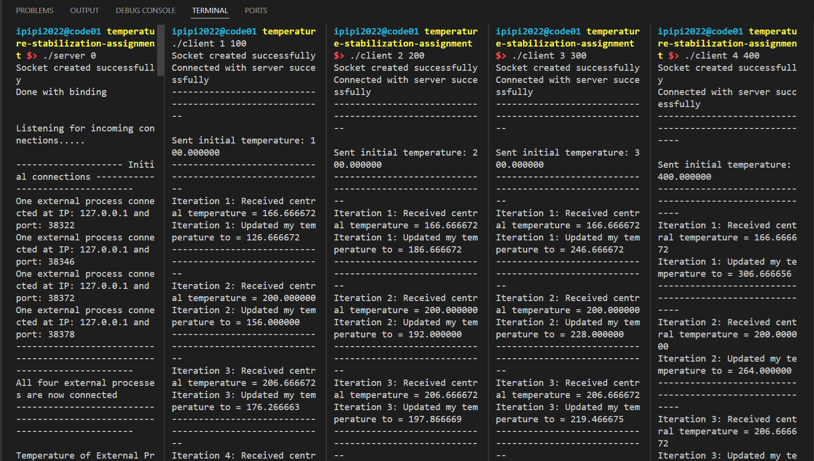
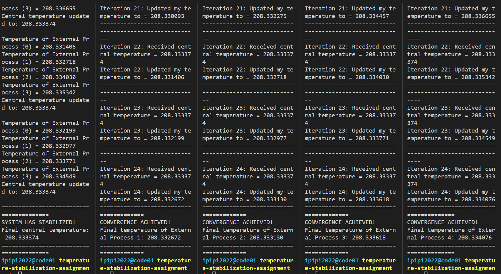
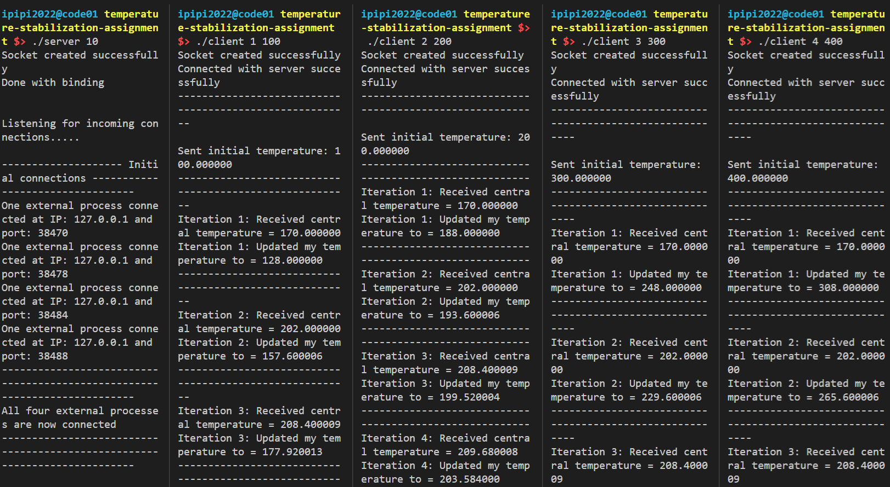
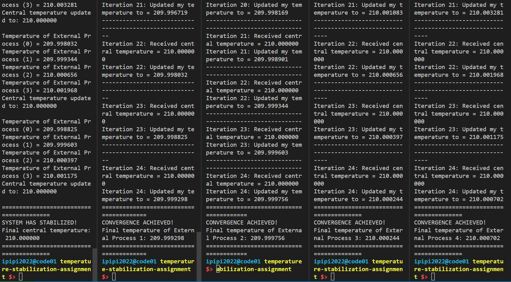
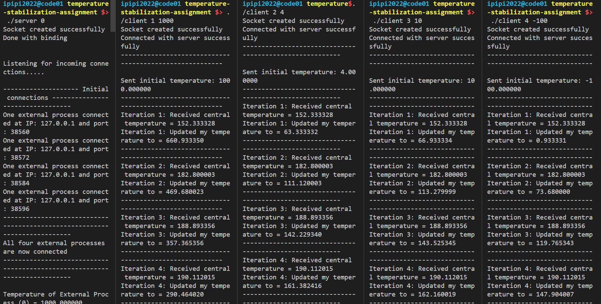
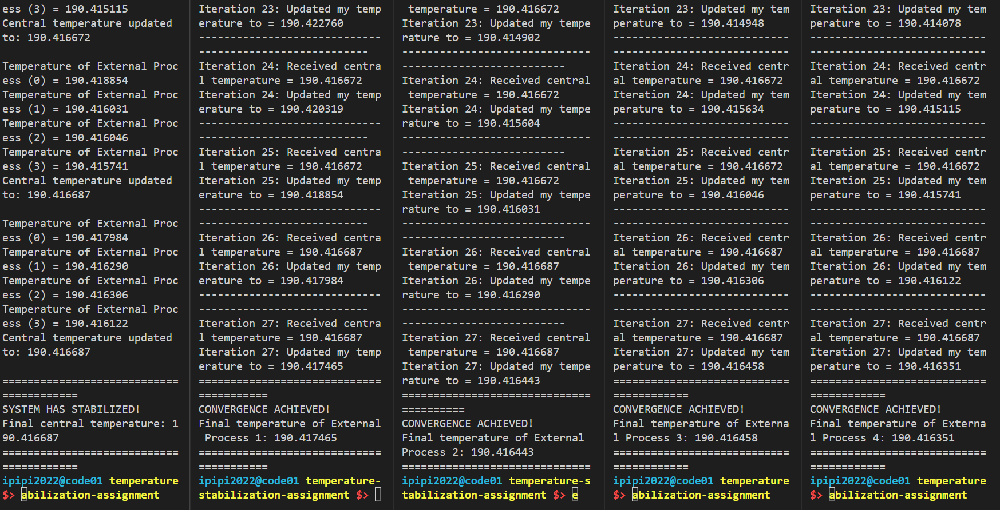

# Temperature Stabilization Using Inter-Process Communication

## Implementation Summary

This project implements a distributed temperature-stabilization system using TCP sockets for inter-process communication. The system consists of 5 processes: one central server and four external client processes that iteratively exchange temperature data until the system reaches thermal equilibrium.

### Features Implemented

- **Multi-process architecture**: 1 central server + 4 external clients
- **Persistent TCP socket connections**: All clients maintain continuous connections with the server
- **Iterative temperature updates**: Both central and external processes update their temperatures each iteration
- **Convergence detection**: System detects stability when all temperatures change by less than 0.001 between iterations
- **Graceful termination**: Server broadcasts termination signals to all clients upon convergence

### Temperature Update Formulas

**External Process Formula:**
```
externalTemp = (3 × externalTemp + 2 × centralTemp) / 5
```

**Central Process Formula:**
```
centralTemp = (2 × centralTemp + ΣexternalTemp) / 6
```

### Convergence Criterion

The system is considered stabilized when all four external process temperatures change by less than `EPS = 1e-3` (0.001) between consecutive iterations.

---

## Compilation Instructions

Compile the server and client programs using gcc:

```bash
gcc utils.c tcp_server.c -o server
gcc utils.c tcp_client.c -o client
```

---

## Running the Program

### Step 1: Start the Central Server

Open a terminal and run the server with an initial temperature:

```bash
./server <initial_temperature>
```

**Example:**
```bash
./server 0
```

The server will start listening on port 2000 and wait for 4 external clients to connect.

### Step 2: Start the External Clients

Open four separate terminals and run each client with its unique index (1-4) and initial temperature:

```bash
./client <client_index> <initial_temperature>
```

**Example:**
```bash
./client 1 100
./client 2 200
./client 3 300
./client 4 400
```

### Expected Behavior

1. Server starts and listens for connections
2. Each client connects and sends its initial temperature
3. Server calculates new central temperature and broadcasts to all clients
4. Clients receive central temperature and calculate their updated temperatures
5. Process repeats until convergence (all temperatures stabilize)
6. Server detects convergence and broadcasts termination signal
7. All processes print final temperatures and exit

---

## Execution Screenshots

The following screenshots demonstrate the program execution with various initial temperature configurations:

### Test Run 1: Initial Temperatures (0, 100, 200, 300, 400)
This run shows the system starting with the server at 0°C and clients at 100°C, 200°C, 300°C, and 400°C. The system converges after approximately 24 iterations to a final temperature of ~208.33°C.





### Test Run 2: Initial Temperatures (10, 100, 200, 300, 400)
Another test with the same initial values but initial server temperature at 10, demonstrating consistent convergence to ~210.0°C.




### Test Run 3: Extreme Values (0, 1000, 4, 10, -100)
This test demonstrates the system's ability to stabilize even with extreme initial temperature differences, including negative values. The system converges to ~190.42°C.





---

## Algorithm Explanation

### Server Algorithm (tcp_server.c)

1. **Initialization**:
   - Create listening socket on port 2000
   - Accept connections from exactly 4 external clients
   - Parse initial central temperature from command line

2. **Iteration Loop**:
   - Receive updated temperatures from all 4 clients
   - Calculate new central temperature using the formula
   - Broadcast updated central temperature to all clients
   - Check convergence by comparing current temperatures with previous iteration
   - If converged, send termination signal (Index = -1) and exit

3. **Convergence Check**:
   - System is stable when `|temperature[i] - prevTemperature[i]| < EPS` for all i
   - EPS = 0.001 (defined constant)

### Client Algorithm (tcp_client.c)

1. **Initialization**:
   - Parse client index and initial temperature from command line
   - Connect to server at 127.0.0.1:2000
   - Send initial temperature to server

2. **Iteration Loop**:
   - Receive central temperature from server
   - Check for termination signal (Index == -1)
   - If not terminated, calculate new external temperature using formula
   - Send updated temperature back to server
   - Repeat until termination signal received

3. **Termination**:
   - Upon receiving termination signal, print final temperature and exit

---

## Project Structure

```
temperature-stabilization-assignment/
├── tcp_server.c         # Central server implementation
├── tcp_client.c         # External client implementation
├── utils.h              # Header file with message structure
├── utils.c              # Utility functions
├── README.md            # This file
├── screenshot1.png      # Execution screenshots
├── screenshot2.png
├── screenshot3.png
├── screenshot4.png
├── screenshot5.png
└── screenshot6.png
```

---

## Technical Details

### Message Structure

Communication between processes uses a C struct:

```c
struct msg {
    float T;      // Temperature value
    int Index;    // Process identifier (-1 for termination signal)
};
```

### Network Configuration

- **Protocol**: TCP (SOCK_STREAM)
- **IP Address**: 127.0.0.1 (localhost)
- **Port**: 2000
- **Connections**: Persistent (maintained throughout execution)

### Convergence Threshold

- **EPS**: 1e-3 (0.001)
- Ensures temperatures stabilize within 0.1% precision

---


# Original Assignment Instructions

### :warning: This is a Linux/Unix OS assignment. It is not an OS/161 Assignment

This means that you will not write code for OS/161. Instead, you will write and test your code on a Linux or any Unix-based OS, e.g., the Linux environment that comes with your CSE4001 container or any Linux machine, AWS, Mac OS X (Terminal). 

### Steps to complete the assignment

1. **Fork & clone** the assignment repository to your workspace (e.g., `/root/workspace/`).
2. **Understand the spec**: read this assignment carefully and review the sample TCP code to identify missing pieces you must add (multi-process flow, message fields, stabilization check).
3. **Build a minimal prototype**: implement a two-process version (one client + the central server) that exchanges a temperature message round-trip.
4. **Scale to all processes**: extend to five processes total (server + four clients), keep persistent TCP connections, and implement the update rules for central/external temps each iteration.
5. **Add convergence logic**: define a tolerance (e.g., `EPS=1e-3`) and stop when all external temps change less than `EPS` between iterations; broadcast a “done” signal.
6. **Test thoroughly**: run in five terminals with several initial temperatures (some different) to verify multiple iterations occur before convergence.
7. **Document & illustrate**: capture screenshots showing all five terminals during execution and at stabilization; place images in the repo and **link them in `README.md`** (verify GitHub renders them correctly).
8. **Commit & push**: include source code only (no binaries or build artifacts). Make sure `README.md` contains build/run instructions (commands, args, ports).
9. **Submit**: paste your repository URL into the Canvas submission box.

:fire: ** A common question about the example code in the previous link is: **The example code seems to solve the assignment. What is left to be done?** 

:high_brightness: **The answer**: Please, read the assignment description and the code to identify the missing parts that need to be completed. 


### If you use the CSE4001 container

If you use the CSE4001 container, I suggest that you clone the sample code (see link to sample code below) or write your own code in the container’s directory `/root/workspace/`. To run the server and client processes, open multiple terminal windows on the same container. To do that, you can: 

1. **Using the Docker app**. Run the CSE4001 container from the Docker app and open a terminal, i.e., use the option `Open in terminal` that is provided by the drown-down `Actions` menu. See figure below: 

    

   Once the terminal is open, choose `Open in external terminal` and then run the `bash` shell by typing bash on the command line. See figure below: 

    

2. **Open multiple terminals from the command line**. To open another terminal on the same active container, type the following command on another terminal. In this case, the terminal will already start running `bash` shell.

```shell
docker exec -it cse4001 bash
```

3. Go to the `/root/workspace/` directory and clone the sample code or create a directory where you will write your code for the assignment. 

   

### Description

In this assignment, you will implement a basic temperature-stabilization system using processes. The multiple processes in the system will communicate with one another using inter-process communication methods. Specifically, your solution will be implemented using **Internet stream (TCP) sockets** for process communication.

The temperature-stabilization system in this assignment consists of 5 processes. Four **external** processes that send their individual temperatures to a **central** process. The central process will then reply by sending its own calculation of the temperature to the external processes. Once the temperature of the entire system has stabilized, the central process will print a message indicating that the system has stabilized and processes will terminate. Each process will receive (or have) its initial temperature upon creation and will recalculate a new temperature according to two formulas:

**External processes:**

$$
\text{externalTemp} \longleftarrow \left(3 \cdot \text{externalTemp} + 2\cdot \text{centralTemp} \right) / 5
$$

**Central process:**

$$
\text{centralTemp} \longleftarrow \left(2 \cdot \text{centralTemp} + \sum_{i=1}^4 \text{externalTemp}_i \right) / 6
$$

Initially, each external process will send its temperature to the central process. If all four temperatures are the same (or sufficiently similar) as those sent by the four processes during the last iteration, the system has stabilized. In this case, the central process will notify each external process that it is now finished (along with the central process itself), and each process will output the final stabilized temperature. If the system has not yet become stable, the central process will send its new (updated) temperature to each of the external processes and await their replies. The processes will continue to run until the temperature has stabilized.

Each external process will be uniquely identified by a command-line parameter. The first parameter to each external process will be its unique number: 1, 2, 3, or 4. The second parameter will be its initial temperature. The central server will be passed one parameter, i.e., its initial temperature. 

### Overview diagram showing TCP sockets for process communication


### Implementation details

- Add some instructions on the `README.md` file on how to run your program.
- Don't worry about killing Zombies. Let them be. You do not need to implement a multi-connection server. As a result, zoombies are unlikely to be an issue. 
- The simplest way to start the implementation is to use the sample source code that comes with this repository. Alternatively, you can use any example you find that shows two processes exchanging some message packaged as a C structure (i.e., `struct`). Given an example with two processes communicating via TCP sockets, you just need to extend the example to implement the solution of the assignment. 

### What to submit

`Add/Commit/Push` the source code of your program into the GitHub repository for the assignment. Do not upload executable files or temporary files that result from the compilation process. 

Describe the execution of your program in the repository's `README.md` file. Here, include figures of relevant screenshots showing the execution of the entire system. For example, if you run each process in a separate terminal, you can capture all terminals working side-by-side into a single screenshot. Submissions without a `README.md` and screenshots showing the program's execution will suffer a 20-point deduction in the grade in the assignment grade. 

Paste the URL of your repository in the Canvas input box for this assignment. 

### Data serialization and book on network programming

This assignment is about using sockets and network communication with multiple processes. The assignment asks you to implement a basic client-server program of a temperature-stabilization system.

The starter code I provide and your solution to the assignment do not perform serialization (I am assuming you will just extend my starter code to complete the assignment). Serialization is not an issue for the starter code provided because processes are exchanging data within the same machine and OS. 

Sending data across the network is not usually done by sending structures or objects (e.g., `struct`, `class`). Instead, network communication is often done by serializing the data to be sent and then de-serializing the data once it is received. When transmitting data through the network, the need for serialization arises because of the different ways different computer architectures represent numerical values such as doubles and floats in terms of their bit representation and byte ordering. 

If you want to learn more about Network Programming and a bit more on the serialization issue, I recommend the following book:

- **Beej's Guide to Network Programming: Using Internet Sockets** by Brian "Beej Jorgensen" Hall. 

The book is available online free of charge (https://beej.us/guide/bgnet/) and also sold by Amazon.com (https://www.amazon.com/dp/1705309909) if you want a paperback version. 


# tcp_client_server (Example)
Starter code example for tcp (socket) client-server system

#### Compilation instructions

```shell
gcc utils.c tcp_server.c -o server
gcc -o client tcp_client.c utils.c
```

#### Here is a typical command line, run each in its own terminal

Open a terminal and run: 

```shell
./server
```

Open four terminals and in each one run: 

```shell
./client <external index> <initial temperature>
```

##### Example:      

```shell
./client 1 100
```

```shell
./client 2 200
```

```shell
./client 3 300
```

```shell
./client 4 400
```


The book is written is a very conversational style that is both enjoyable and accessible. I think you will enjoy reading it. Give it a try if you have time. If you want just to learn about serialization in network communication then read the Section **7.5 Serialization—How to Pack Data** (https://beej.us/guide/bgnet/html/split-wide/slightly-advanced-techniques.html#serialization). 

 
